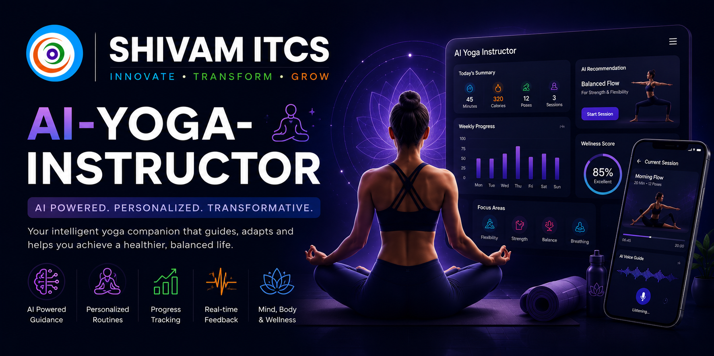
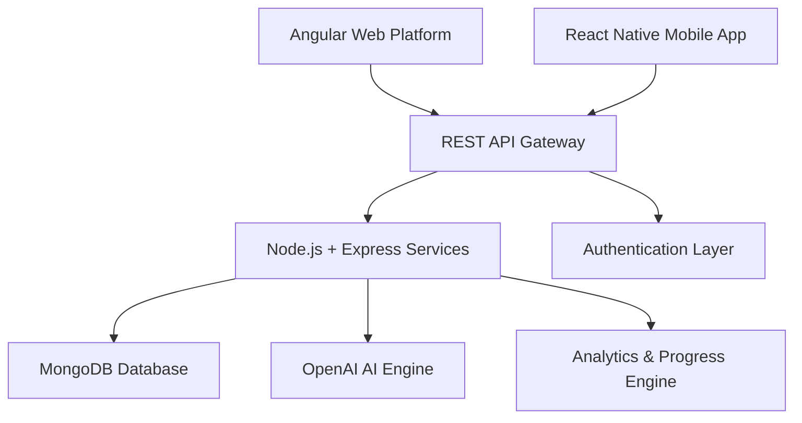
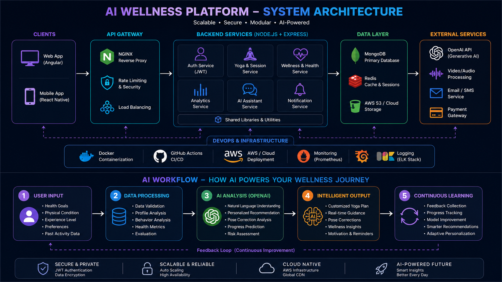
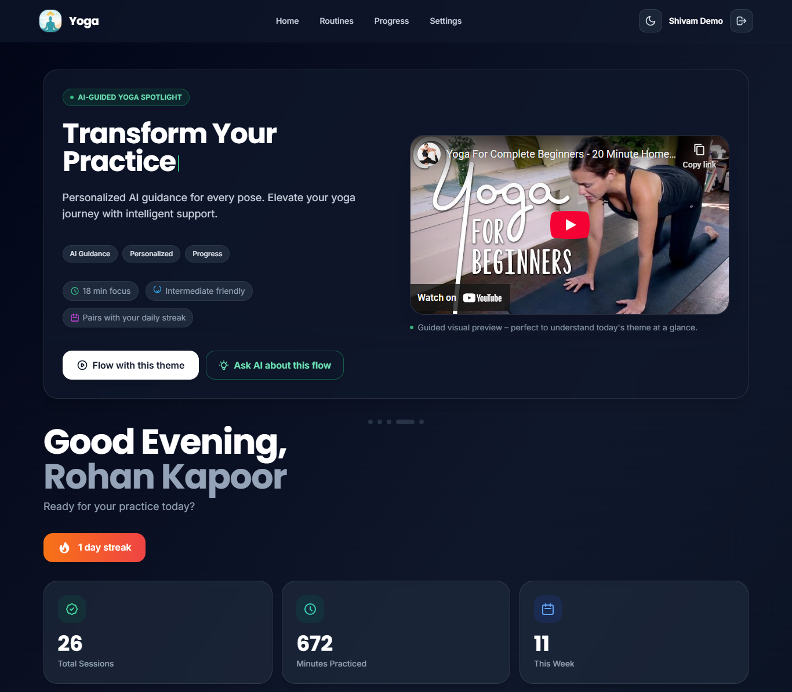
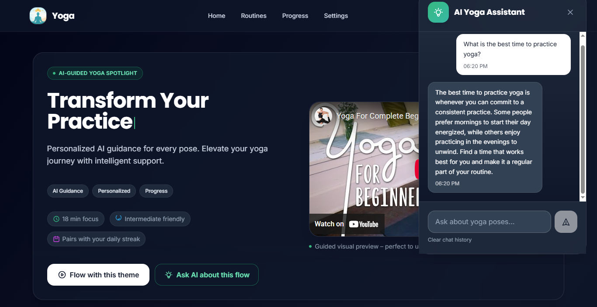
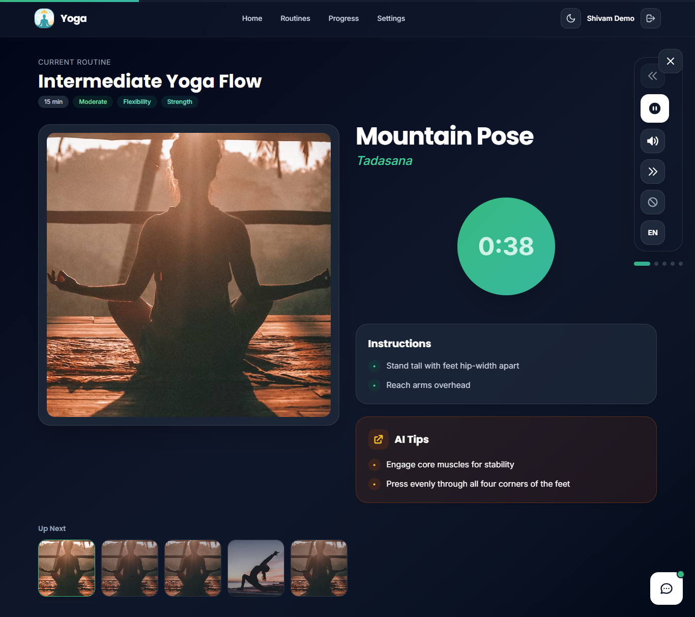
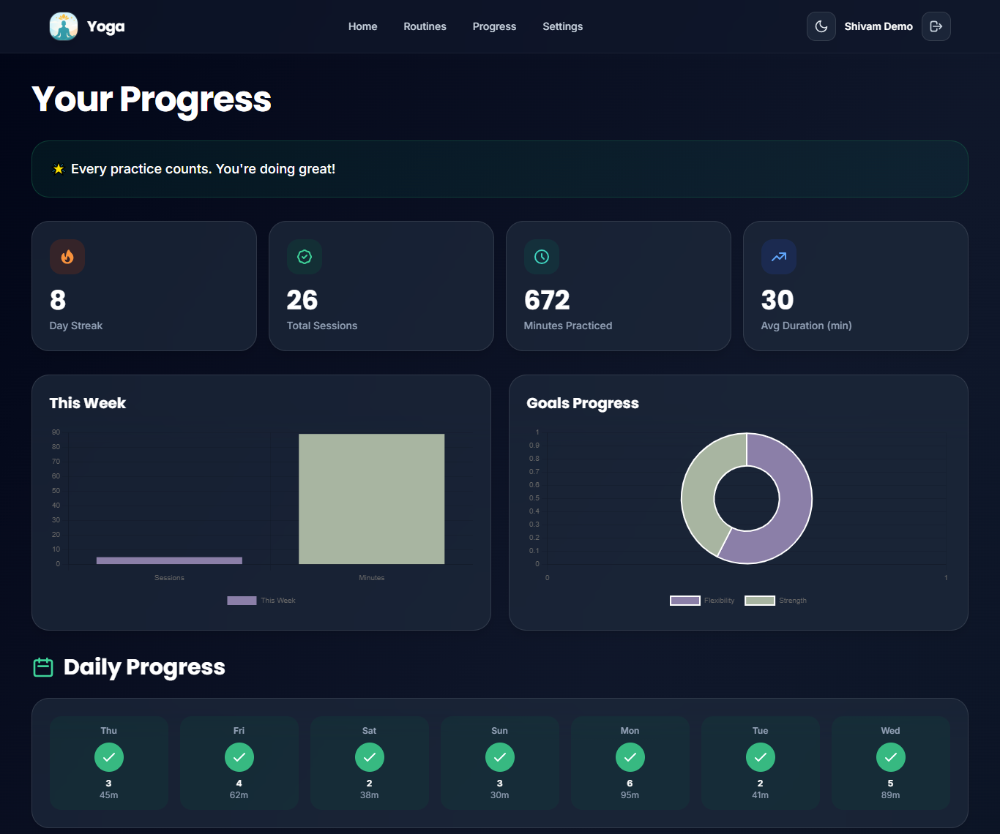
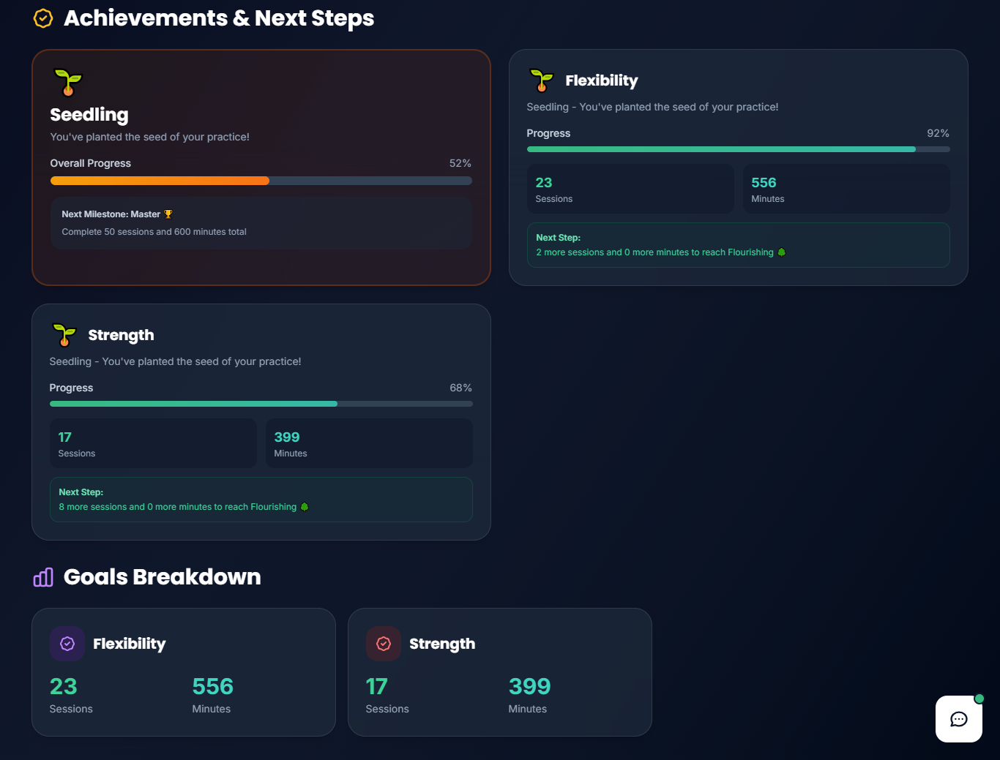
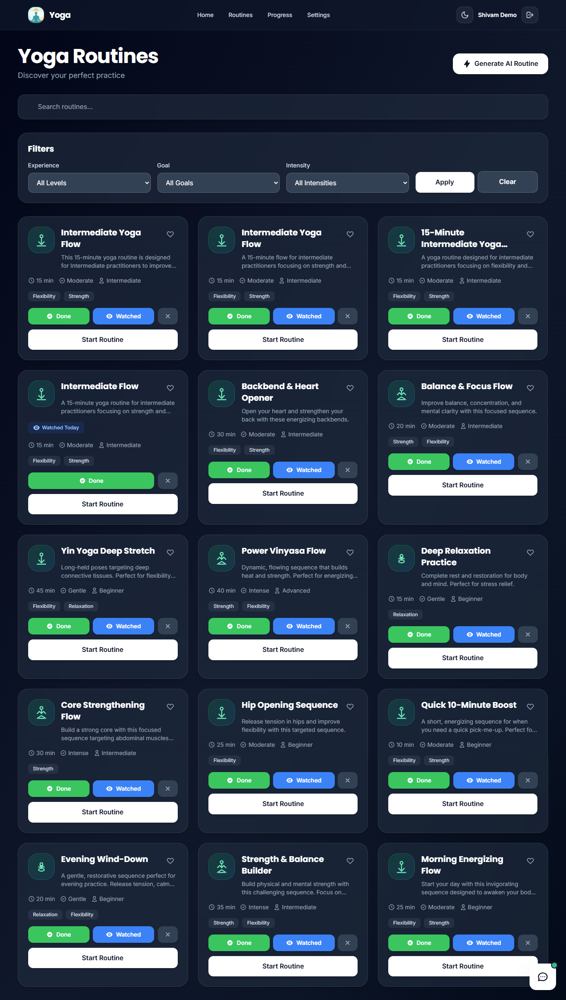
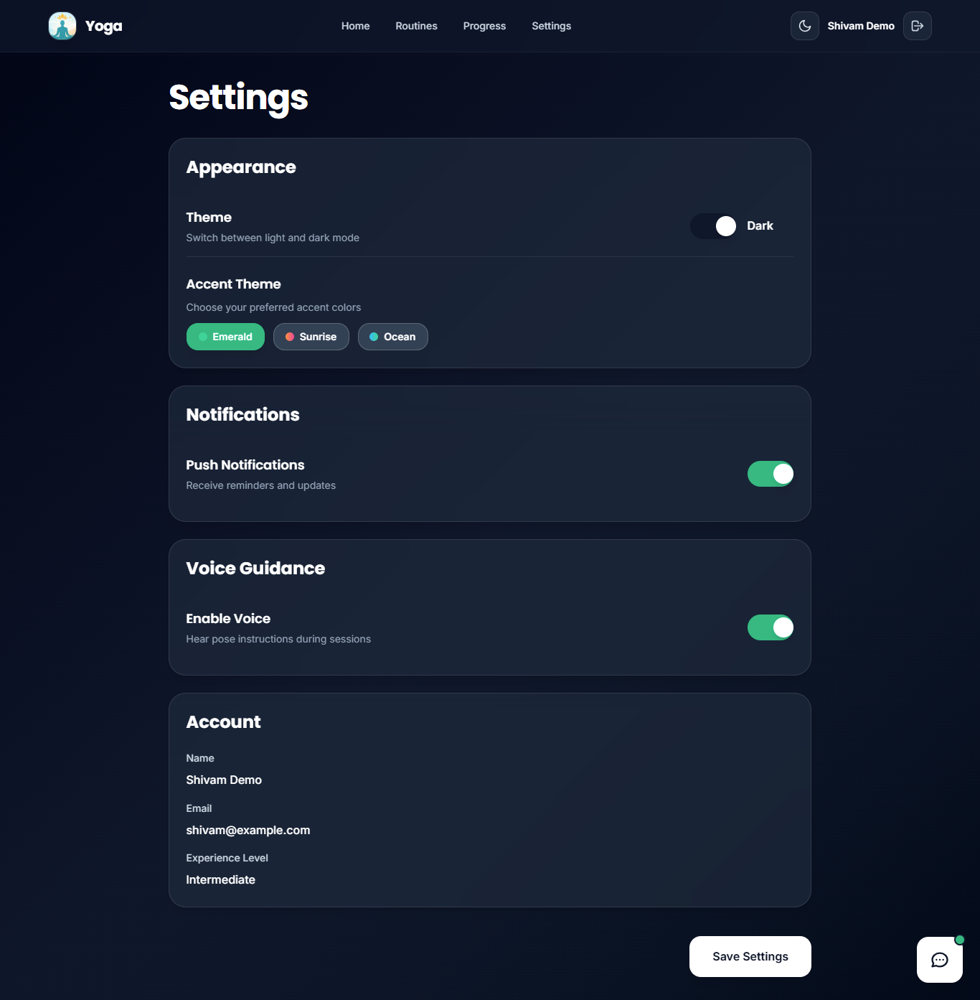

# 🧘 AI Wellness Platform


 

Enterprise-grade AI-powered wellness platform built with MEAN stack and React Native/Expo, designed for personalized yoga experiences, wellness analytics, guided sessions, AI-assisted recommendations, and scalable cross-platform health-tech workflows.

<p align="center">
  
</p> 

---

## Platform Highlights 

- AI-powered personalized yoga routines
- Cross-platform wellness ecosystem
- Guided yoga & meditation sessions
- Wellness analytics & progress tracking
- JWT-based authentication system
- OpenAI-powered recommendation engine
- Responsive Angular web application
- React Native mobile experience
- Enterprise-grade REST API architecture
- Scalable MEAN stack infrastructure

---

## Core Modules

- AI Wellness Dashboard
- Personalized Yoga Routines
- Guided Yoga Sessions
- Meditation & Breathing Workflows
- Wellness Progress Tracking
- Analytics & Reporting
- User Authentication System
- Mobile Wellness Experience
- AI Assistant Integration
- Settings & Preferences Management

---

## Enterprise Features

- Modular MEAN stack architecture
- AI-powered wellness recommendation engine
- JWT authentication & protected APIs
- Responsive Angular dashboard ecosystem
- RESTful API infrastructure
- Cross-platform mobile workflows
- OpenAI integration for intelligent routines
- Analytics & progress visualization
- Secure middleware pipeline
- Scalable frontend architecture
- Mobile-first user experience
- Enterprise-ready deployment structure

---

## Technology Stack

### Frontend Engineering

- Angular 17+
- TypeScript
- Angular Material
- RxJS
- Chart.js

---

### Mobile Engineering

- React Native
- Expo
- React Navigation
- React Native Paper
- React Native Chart Kit
- Expo Speech

---

### Backend Infrastructure

- Node.js
- Express.js
- JWT Authentication
- RESTful APIs
- Middleware Architecture

---

### Database & AI

- MongoDB
- Mongoose ODM
- OpenAI APIs
- AI Recommendation Systems

---

## Platform Overview

The AI Wellness Platform is designed to centralize personalized yoga experiences, guided wellness sessions, analytics tracking, AI-assisted recommendations, and cross-platform health-tech workflows into a unified scalable ecosystem.

The platform enables users to manage wellness goals, track activity progress, access AI-generated yoga routines, and experience guided meditation workflows through a modern mobile-first architecture powered by Angular, Node.js, MongoDB, React Native, and OpenAI technologies.

The system is engineered with scalability, modularity, performance optimization, and enterprise-grade API architecture in mind to support evolving digital wellness experiences.

---

### Architecture Highlights

- Modular MEAN stack architecture
- AI-powered wellness workflows
- Cross-platform application ecosystem
- JWT-secured REST API infrastructure
- Scalable backend service layer
- Mobile-first wellness experience
- Analytics-driven engagement system

---

# 🏗️ System Architecture



---

<p align="center">
  
</p>

---

# 📸 Platform Preview

Modern AI-powered wellness dashboards and guided digital experiences designed for scalable cross-platform wellness engagement.

---

## 🖥️ AI Wellness Dashboard

<p align="center">
  
</p>

---

## 🤖 AI Assistant Experience

<p align="center">
  
</p>

---

## 🧘 Guided Yoga Sessions

<p align="center">
  
</p>

---

## 📊 Analytics & Progress Tracking

<p align="center">
  
</p>

---

## 📈 Wellness Achievement System

<p align="center">
  
</p>

---

## 🗂️ Routine Management

<p align="center">
  
</p>

---

## ⚙️ Application Settings

<p align="center">
  
</p>

---

## Key Use Cases

- Personal wellness management
- Yoga and meditation coaching
- Daily habit tracking
- AI-powered fitness recommendations
- Corporate wellness programs
- Digital health engagement platforms
- Wellness analytics and reporting

---

# 💼 Business Case Study

## Problem Statement

Modern wellness applications often struggle with fragmented user experiences, limited personalization, disconnected analytics systems, and lack of intelligent wellness recommendations.

Traditional fitness and wellness platforms frequently fail to deliver:
- personalized wellness workflows
- AI-driven recommendations
- scalable cross-platform experiences
- real-time progress tracking
- engaging guided wellness sessions

---

## Solution

The AI Wellness Platform was developed to centralize yoga experiences, wellness analytics, AI-assisted recommendations, and guided digital wellness workflows into a scalable modern ecosystem.

The platform enables:
- AI-generated yoga routines
- guided meditation workflows
- wellness analytics tracking
- personalized recommendations
- cross-platform accessibility
- secure API-driven architecture

---

## Business Outcomes

- Personalized wellness experiences
- Improved user engagement
- Better wellness habit consistency
- AI-driven recommendation workflows
- Cross-platform accessibility
- Scalable digital wellness ecosystem

---

## Technical Approach

### Frontend
- Angular 17+
- TypeScript
- Angular Material
- RxJS
- Chart.js

### Backend
- Node.js
- Express.js
- JWT Authentication
- RESTful API Architecture

### Mobile
- React Native
- Expo
- React Navigation
- React Native Paper

### AI & Data
- MongoDB
- OpenAI APIs
- AI Recommendation Engine

---

## Key Outcomes

- Improved user wellness engagement
- Personalized digital wellness experiences
- Cross-platform accessibility
- AI-enhanced recommendation workflows
- Scalable health-tech architecture
- Modern wellness analytics ecosystem

---

# 🚀 Platform Capabilities

## 🧘 Wellness Experiences

- Personalized yoga routines
- Guided meditation workflows
- AI-assisted wellness recommendations
- Daily wellness tracking
- Interactive guided sessions

---

## 📊 Analytics & Progress Tracking

- Wellness analytics dashboards
- Session history monitoring
- Progress visualization
- Streak & achievement tracking
- User engagement insights

---

## 🔐 Authentication & Security

- JWT authentication workflows
- Protected REST APIs
- Secure session management
- Input validation pipelines
- Environment-based configurations

---

## 📱 Cross-Platform Ecosystem

- Angular web application
- React Native mobile platform
- Expo-powered mobile workflows
- Unified REST API architecture
- Responsive user experiences

---

## 🧠 AI & Automation

- OpenAI-powered recommendation engine
- Intelligent yoga routine generation
- AI wellness workflows
- Personalized experience optimization
- Smart activity insights

---

## 🏗️ Enterprise Engineering

- Modular MEAN stack architecture
- Scalable backend infrastructure
- RESTful API ecosystem
- Mobile-first engineering
- Enterprise-ready deployment workflows

---

# 🛣️ Product Roadmap

### Phase 1 — Core Wellness Platform

- Personalized yoga routines
- Wellness analytics dashboards
- Guided yoga sessions
- User authentication workflows
- Cross-platform web & mobile support

---

### Phase 2 — AI Wellness Expansion

- AI-generated wellness recommendations
- Intelligent routine adaptation
- Personalized meditation workflows
- Smart engagement insights
- Enhanced analytics engine

---

### Phase 3 — Advanced Health-Tech Features

- Real-time posture detection
- Wearable device integrations
- AI-powered health insights
- Voice-assisted wellness coaching
- Advanced user behavior analytics

---

### Phase 4 — Enterprise Ecosystem Growth

- Multi-user wellness infrastructure
- Organization wellness management
- Scalable AI workflow engine
- Enterprise reporting systems
- AI-driven wellness automation

---

# 🧠 Engineering Vision

The AI Wellness Platform is designed with a modern product-engineering mindset focused on scalability, AI-assisted wellness experiences, cross-platform accessibility, analytics-driven engagement, and enterprise-grade architecture.

The platform represents a modular health-tech ecosystem engineered to support evolving digital wellness workflows through modern frontend engineering, secure backend infrastructure, AI-powered recommendation systems, and scalable mobile experiences.

The engineering approach emphasizes:
- scalable application architecture
- modular frontend systems
- secure API ecosystems
- AI-enabled wellness workflows
- mobile-first product experiences
- enterprise-ready deployment infrastructure

---

# 🎯 Platform Focus Areas

- Digital Wellness Platforms
- AI-Powered Recommendations
- Yoga & Meditation Applications
- Health-Tech Solutions
- Cross-Platform Mobile Apps
- Wellness Analytics
- Personalized User Experiences
- MEAN Stack Applications

---

## Live Platform

🌐 https://mean.shivamitcs.in/

---

# 📁 Repository Structure

```txt
/assets
   /banner
   /screenshots
   /architecture
   /diagrams
   /icons

/backend
/angular-app
/mobile-app
```

---

# 🚀 Getting Started

## Prerequisites

- Node.js 18+
- MongoDB
- Angular CLI
- Expo CLI
- OpenAI API Key

---

## Backend Setup

```bash
npm install
npm run dev
```

---

## Angular Frontend

```bash
cd angular-app
npm install
npm start
```

---

## React Native Mobile App

```bash
cd mobile-app
npm install
npm start
```

---

# 🔧 Environment Configuration

```env
PORT=3000
MONGODB_URI=your_mongodb_uri
JWT_SECRET=your_jwt_secret
OPENAI_API_KEY=your_openai_api_key
```

---

## Repository Topics

```txt
ai-wellness
yoga-platform
health-tech
mean-stack
angular
nodejs
mongodb
react-native
expo
openai
wellness-analytics
personalized-recommendations
jwt-authentication
cross-platform-app
digital-wellness
```

---

# 📄 License

This repository is intended for platform showcase, architecture presentation, and engineering demonstration purposes.

Copyright © 2026 SHIVAM ITCS
