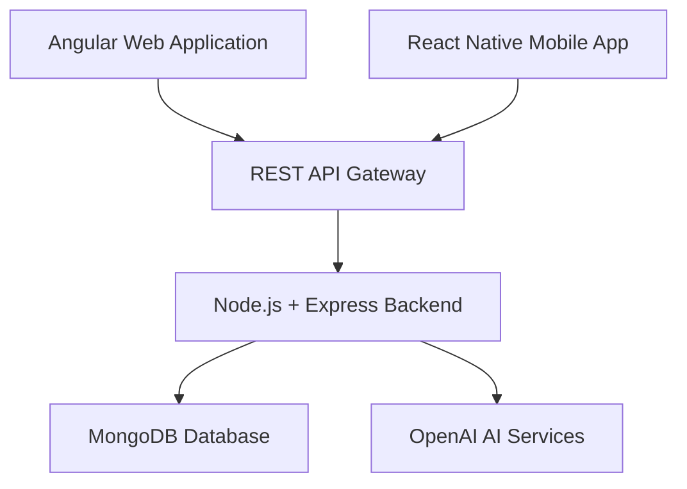
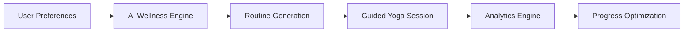

# 🧘 AI Wellness Platform

<p align="center">


</p>

---

## ✨ Overview

SHIVAMITCS AI Wellness Platform is an enterprise-grade AI-powered wellness ecosystem engineered to deliver personalized yoga experiences, guided meditation workflows, intelligent progress tracking, and cross-platform digital wellness solutions.

The platform combines AI-assisted routine generation, interactive guided sessions, analytics dashboards, and scalable wellness infrastructure to create a modern health-tech experience across web and mobile platforms.

Built using the MEAN stack and React Native/Expo architecture, the platform delivers seamless user experiences optimized for scalability, performance, and engagement.

---

# 🚀 Key Features

## 🧠 AI-Powered Wellness Engine

- AI-generated yoga routines
- Personalized wellness recommendations
- Intelligent difficulty adaptation
- AI-assisted yoga guidance
- Smart wellness insights
- Voice-assisted yoga sessions

---

## 📱 Cross-Platform Experience

- Angular 17+ responsive web application
- React Native mobile application
- Expo-powered mobile workflows
- Unified REST API ecosystem
- Mobile-first wellness architecture

---

## 📊 Analytics & Progress Tracking

- Session history tracking
- Wellness streak monitoring
- Goal progression analytics
- Weekly activity insights
- Interactive performance dashboards
- User engagement tracking

---

## 🔐 Enterprise Security

- JWT authentication
- Secure REST APIs
- Protected user sessions
- Role-based access workflows
- Input validation & sanitization
- Secure environment configurations

---

## 🎨 Modern Wellness UI

- Dark premium interface
- Smooth interactive workflows
- Minimal calming design system
- Glassmorphism-inspired components
- Optimized accessibility experience
- Responsive cross-device layouts

---

# 🏗️ Platform Architecture



---

# 🧠 AI Workflow Architecture



---

# 🛠️ Enterprise Technology Stack

## Frontend Engineering

- Angular 17+
- TypeScript
- Angular Material
- RxJS
- Chart.js

---

## Mobile Engineering

- React Native
- Expo
- React Navigation
- React Native Paper
- React Native Chart Kit
- Expo Speech

---

## Backend Infrastructure

- Node.js
- Express.js
- JWT Authentication
- RESTful APIs
- Middleware Architecture

---

## Database & AI

- MongoDB
- Mongoose ODM
- OpenAI APIs
- AI Recommendation Systems

---

# 📸 Platform Preview

## 🖥️ AI Wellness Dashboard


---

## 🤖 AI Assistant Experience


---

## 🧘 Guided Yoga Sessions


---

## 📊 Analytics & Progress Tracking


---

## 📈 Wellness Achievement System


---

## 🗂️ Routine Management


---

## ⚙️ Application Settings


---

# ☁️ Deployment Architecture

## Web Platform
- Angular production deployment
- Optimized frontend builds
- Nginx reverse proxy support

---

## Backend Services
- Node.js API infrastructure
- MongoDB cloud integration
- Environment-based configurations

---

## Mobile Deployment
- Expo deployment workflows
- Android & iOS support
- Cross-platform mobile delivery

---

# 🔄 Platform Workflow

1. User onboarding & wellness assessment
2. AI-powered profile generation
3. Personalized yoga recommendations
4. Guided wellness sessions
5. Progress analytics tracking
6. Continuous wellness optimization

---

# ⚡ Performance Optimizations

- Lazy-loaded Angular modules
- Optimized REST APIs
- Efficient state management
- MongoDB query optimization
- Mobile rendering optimization
- Scalable MEAN architecture

---

# 📈 Business Impact

The platform is designed to improve user wellness engagement through AI-assisted yoga experiences, intelligent recommendation systems, and modern wellness analytics.

## Key Outcomes

- Personalized digital wellness experiences
- AI-enhanced user engagement
- Cross-platform accessibility
- Scalable health-tech infrastructure
- Improved user retention workflows
- Modern enterprise wellness architecture

---

# 🧠 Engineering Highlights

- Enterprise MEAN stack architecture
- Cross-platform wellness engineering
- AI-powered recommendation systems
- Secure JWT authentication workflows
- Modular frontend architecture
- RESTful API ecosystem
- Mobile-first application design
- Analytics-driven user experiences

---

# 🔐 Authentication System

- JWT-based authentication
- Secure password hashing
- Protected API endpoints
- Session management workflows
- OAuth-ready architecture

---

# 📊 Progress Tracking System

- Session history analytics
- Wellness streaks
- Goal completion tracking
- Weekly insights dashboards
- Activity visualization
- Habit consistency monitoring

---

# 🌐 Live Demo

## Web Application
https://mean.shivamitcs.in/

---

# 📁 Project Structure

```bash
.
├── assets/
│   ├── banner/
│   ├── screenshots/
│   ├── architecture/
│   ├── diagrams/
│   └── icons/
│
├── backend/
│   ├── models/
│   ├── routes/
│   ├── middleware/
│   └── services/
│
├── angular-app/
│   └── src/
│
├── mobile-app/
│   └── src/
│
├── README.md
├── LICENSE
└── package.json
```

---

# 🚀 Getting Started

## Prerequisites

- Node.js 18+
- MongoDB
- Angular CLI
- Expo CLI
- OpenAI API Key

---

## Backend Setup

```bash
npm install
npm run dev
```

---

## Angular Frontend

```bash
cd angular-app
npm install
npm start
```

---

## React Native Mobile App

```bash
cd mobile-app
npm install
npm start
```

---

# 🔧 Environment Configuration

```env
PORT=3000
MONGODB_URI=your_mongodb_uri
JWT_SECRET=your_jwt_secret
OPENAI_API_KEY=your_openai_api_key
```

---

# 🧩 Future Roadmap

- AI posture detection
- Real-time motion analysis
- Wearable integrations
- Advanced wellness analytics
- Multi-language support
- AI meditation experiences
- Smart health recommendations
- Offline mobile support

---

# 📄 License

MIT License

---

# 👨‍💻 Developed By

## SHIVAMITCS

Engineered to deliver scalable AI-powered wellness experiences across modern digital platforms.
